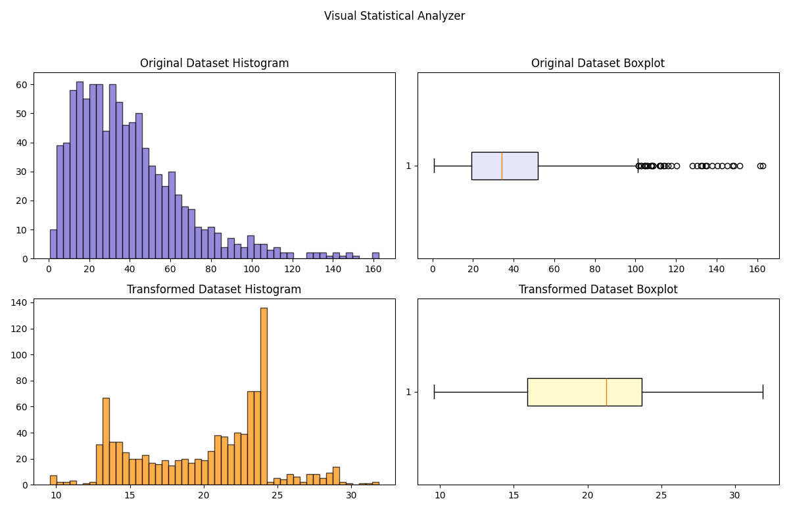

# Visual Statistical Analyzer

This project is a Python-based tool for statistical visualization and numeric analysis. It displays histograms and boxplots of synthetic datasets, including a transformed version, and calculates common statistical summaries and probabilities.

## 📊 Features
- Generates synthetic data using a Gamma distribution
- Transforms data with a nonlinear `sqrt * sin` operation
- Plots:
  - Histogram + boxplot of original dataset
  - Histogram + boxplot of transformed dataset
- Calculates:
  - Quartiles (Q1, Q3) and IQR
  - Outlier thresholds and counts
  - Probability approximations using a logistic-style custom CDF

## 🧠 Learning Outcomes
- Visual understanding of distribution skew and spread
- Custom transformations and comparisons
- Identifying and reasoning about outliers
- Approximation of cumulative probabilities

## 🚀 Run the Tool
```bash
python statistical_analyzer.py
```

## 📷 Output Preview



## 📦 Requirements
- Python 3.x
- matplotlib
- numpy

## 💡 Future Enhancements
- Export summary statistics to file
- Add interactive widgets (e.g., with Streamlit)
- Support real dataset upload (CSV)

## 👩‍💻 Author
Nasim Bayati

---
This project is original and intended for public learning and demonstration. No academic assignment visuals or proprietary code are included.
